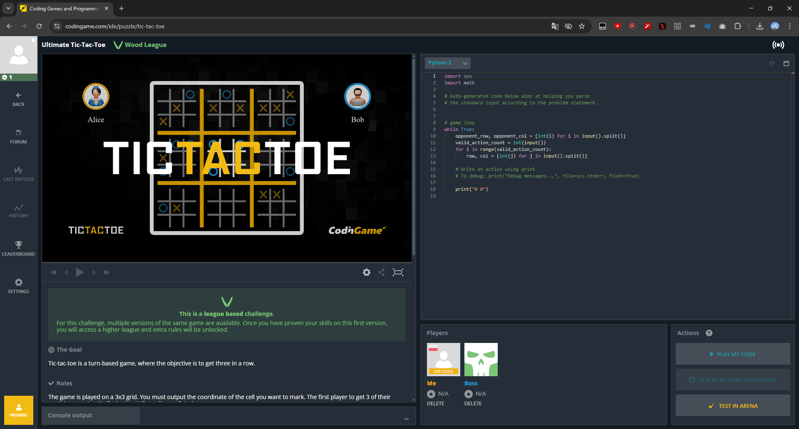
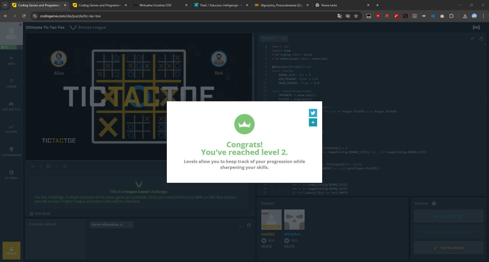
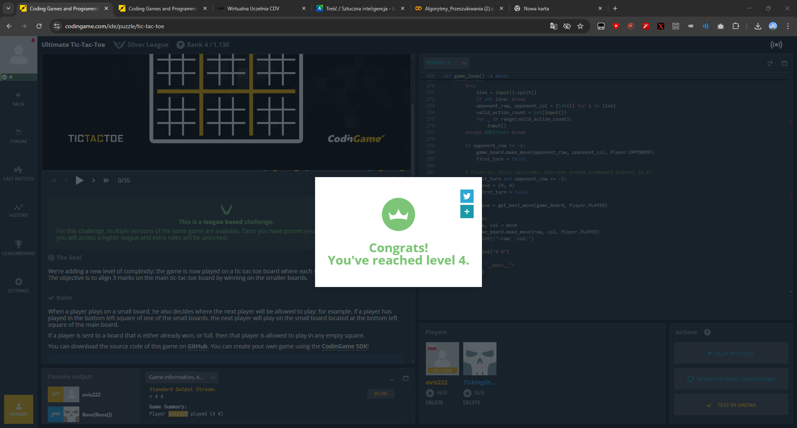
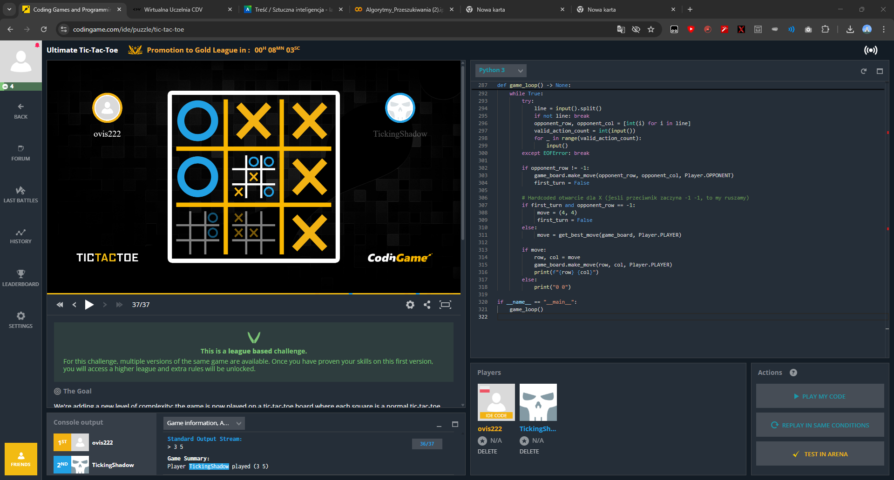
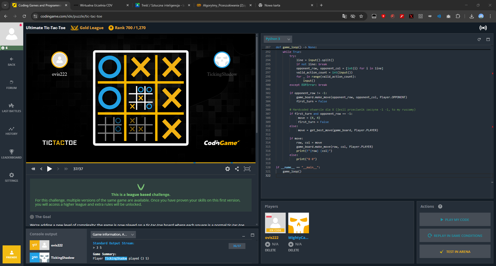

# Dokumentacja Końcowa - AI do Kółka i Krzyżyka

Zrealizowano implementację sztucznej inteligencji dla dwóch wariantów gry:
1.  **Kółko i Krzyżyk (Standard)**: Algorytm Minimax (gra perfekcyjna).
2.  **Ultimate Kółko i Krzyżyk**: Algorytm Minimax z ograniczeniem głębokości i funkcją heurystyczną (heurystyka oceny stanu planszy).

## Zrealizowane Zadania

### 1. Kółko i Krzyżyk (`tic_tac_toe.py`)
- Zaimplementowano funkcję `minimax`, która rekurencyjnie przeszukuje całe drzewo gry.
- Dodano odcinanie Alpha-Beta dla optymalizacji.
- Bot gra perfekcyjnie (zawsze remisuje lub wygrywa).

### 2. Ultimate Tic-Tac-Toe (`ultimate_tic_tac_toe.py`)
- Zaimplementowano funkcję `score` (heurystykę), która ocenia szanse gracza:
    - Nagradza za zdobyte małe plansze (duże punkty).
    - Premiuje zajęcie środka i rogów (strategia).
    - Ocenia pozycję na jeszcze nieukończonych małych planszach.
- Zmodyfikowano `minimax` do pracy z limitem głębokości (domyślnie 2 ruchy w przód).
- Bot potrafi grać w czasie rzeczywistym na platformie Codingame.
- **Wynik weryfikacji:** Bot zakwalifikował się do **Złotej Ligi (Gold League)** (awans potwierdzony w systemie).

## Zrzuty Ekranu: Postęp w Ligach







## Jak Uruchomić (Testowanie)

### Na platformie Codingame
1.  Skopiuj kod z pliku `tic_tac_toe.py` (dla małej gry) lub `ultimate_tic_tac_toe.py` (dla dużej gry).
2.  Wejdź na odpowiednie wyzwanie na codingame.com.
3.  Wklej kod do edytora.
4.  Kliknij **TEST IN ARENA**, aby wysłać bota do ligi i zdobyć punkty.

### Lokalnie (Symulacja)
Możesz uruchomić grę w terminalu, wpisując ruchy przeciwnika ręcznie:
```bash
python tic_tac_toe.py
```
Format wejścia (zgodny z Codingame):
1.  Współrzędne ruchu przeciwnika (np. `0 0`). Jeśli pierwszy ruch, wpisz `-1 -1`.
2.  Liczba poprawnych akcji (wpisz np. `0` lub dowolną liczbę, bot to ignoruje w tej implementacji).
